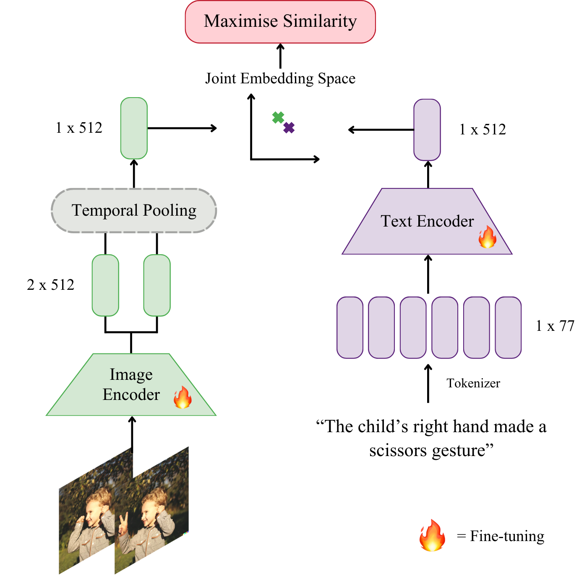

# Learning Temporal Relations for Evaluating Instruction-Guided Image Editing

This repository contains the implementation of the research **"Learning Temporal Relations for Evaluating Instruction-Guided Image Editing"**, a framework that adapts spatio-temporal modeling techniques from video understanding to evaluate instruction-guided image edits.

## Overview

<p align="center">
    
</p>

### **Abstract**
*Despite rapid progress in image editing models, there remains no standard human-aligned framework for evaluating instruction-guided edits. Current automated visual metrics focus on pixel-level fidelity rather than whether an edit follows the instruction, hence frequently struggle to capture semantic alignment between visual edits and user intent, creating a critical research gap. Reliable evaluation is crucial: inadequate metrics can misrepresent model performance and hinder the development of consistent evaluation standards. To address this, we conceptualise instruction-
guided image editing as a temporal reasoning problem in vision-language models. Humans can perceive edits naturally as before-after transitions, changes over time rather than static differences. We use a video-based CLIP model
to encode original and edited images as a short two-frame sequence, capturing the dynamics of visual change. A user study shows that while overall correlation with human judgments is moderate (ρ = 0.12), alignment improves (i) for edits that are clearly successful or unsuccessful (ρ = 0.42), (ii) for specific edit types (e.g., object addition/removal), and (iii) with more training data. These findings suggest that temporal reasoning is a promising direction for resolving the discrepancy between automated
visual metrics and human perception.*

---

## **Main Contributions**
- A new approach is proposed for assessing instruction-guided image editing, bridging the gap between automated metrics and human perception.
- An extensive annotation study was conducted to analyze the correlation between the proposed metric and human preferences.
- A detailed analysis of the fine-tuning process and annotation study highlights key challenges, strengths, and limitations.

---

## **Installation**

### **Environment Setup**
Most analyses are performed in Jupyter notebooks, with required libraries installed inside them. To avoid dependency conflicts, two separate virtual environments were used:
1. **For ViFi-CLIP fine-tuning**  
2. **For data analysis**

#### **(1) Setup for Fine-tuning ViFi-CLIP**
The official ViFi-CLIP installation guide can be followed: [Installation ViFi-CLIP](https://github.com/piadonabauer/thesis-edit-evaluation/blob/main/ViFi-CLIP/docs/INSTALL.md).  

The guide describes executing the following commands:

```bash
cd ViFi-CLIP
python3 -m venv .env
source .env/bin/activate
pip install -r requirements.txt
```

Also, install Apex:

```bash
git clone https://github.com/NVIDIA/apex
cd apex
pip install -v --disable-pip-version-check --no-cache-dir --global-option="--cpp_ext" --global-option="--cuda_ext" ./
```

#### **(2) Setup for Data Analysis**

```bash
cd labeling
python3 -m venv .env
source .env/bin/activate
pip install -r requirements.txt
```

## **Data Preparation**

### **API Credentials**
Three APIs are accessed in this repository:

- **OpenAI** for GPT-as-a-judge
- **Gradio** for the demo interface
- **MongoDB** for annotation storage

Credentials need to be stored in a .env file for secure access. The .env file should be stored in the top directory with the following content:

```bash
MONGO_USER=x
MONGO_PASSWORD=x
MONGO_CLUSTER_URL=x
GRADIO_USER=x
GRADIO_PASSWORD=x
OPENAI_API_KEY=x
```

### **Datasets**

Dataset preparation instructions are provided in a separate [README](data/DATASET.md). The required textual data files are included in the repository, except for the images, which must be retrieved and processed into video format.


## **ViFi-CLIP**
The vision-language model used for fine-tuning is **[ViFi-CLIP](https://github.com/muzairkhattak/ViFi-CLIP)**, a video-specific adaptation of CLIP.

### Model Checkpoints
Due to repository size limitations, model checkpoints (ablated models and cross-validation models) are not included here.
The **baseline model checkpoints** (ViT-B/16, 2 frames, fine-tuned on HumanEdit) are uploaded to [Google Drive](https://drive.google.com/drive/folders/1CS_8rOwnMhkAFcDPoJFcptRdQROAhMi1?usp=sharing). Folders include for every fold:

- Model configuration (.yaml)
- Logs (.txt)
- Evaluation metric file (.json)
- The checkpoint (.pth)

Other models can be reproduced using the fine-tuning instructions below.

### **Fine-tuning Process**
To reproduce a model (e.g., ViT-B/16, 2 frames, trained on HumanEdit, fold 1):

1. Navigate to the corresponding folder:
`temporal-relation-eval/ViFi-CLIP/output/crossvalidation/vitb16_2_humanedit_freeze_none/fold`

2. Adjust paths in the .yaml configuration file.

3. Run the training command:

```bash
cd ViFi-CLIP
python -m torch.distributed.run --nproc_per_node=1 main.py \
-cfg output/crossvalidation/vitb16_2_humanedit_freeze_none/fold1/16_32_vifi_clip_all_shot.yaml \
--output output/crossvalidation/vitb16_2_humanedit_freeze_none/fold1
```


For more details, refer to the official ViFi-CLIP [Training Guide](ViFi-CLIP/docs/TRAIN.md).


## **Repository Structure**

### `/data`
Contains resources related to the HumanEdit and MagicBrush datasets, including:
- Instructions for dataset preparation (`preprocessing.ipyn`)
- Notebook for data visualization (`visualization.ipyn`)
- Text files for fine-tuning (video clips are not included)


### `/experiments`
Contains additional analyses, not directly related to ViFi-CLIP, including:
- Analysis of VIEScore's ratings of MagicBrush validation split (`/experiments/viescore`)
- Computation of automated metrics for MagicBrush's validation split (`metrics.ipyn`)
- GPT-based ratings for MagicBrush (`gpt.ipynb`)
- Correlation analysis between automated metrics and human annotations (`correlation.ipynb`)


### `/labeling/`
Contains all labeling-related components, divided into:

#### Gradio Interface (`/labeling/gradio/`)
- Main gradio demo in `/labeling/gradio/Image-Edit-Annotation`: [](https://huggingface.co/spaces/piadonabauer/Image-Edit-Annotation)
- MongoDB setup (`setup_db.ipynb`)
- Data retrieval of MongoDB (`data_retrieval_db.ipynb`)

#### Analysis of Labeling Study (`/labeling/analysis/`)
- Rating preprocessing (`label_preprocessing.ipynb`)
- GPT-based classification of the datapoints of MagicBrush (`prompt_classification_gpt.ipynb`)
- Human vs. ViFi-CLIP correlation (`correlation_vifi_human.ipynb`)
- Annotation files for all raters individually & overall (`/labeling/analysis/annotations/`)
- Cross-validation results (`/labeling/analysis/crossvalidation/`)

### `/ViFi-CLIP/`
Used for:
- Fine-tuning (see instructions above)
- Performing inference: computing similarity scores between an image edit & instruction (`inference.ipynb`)


## Acknowledgements

The code for model fine-tuning is based on [ViFi-CLIP](https://github.com/muzairkhattak/ViFi-CLIP)'s repository. 
